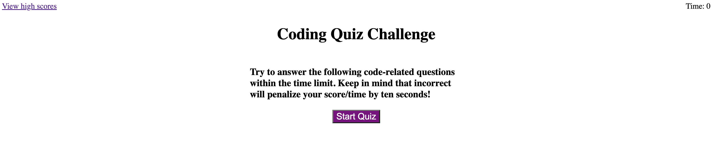
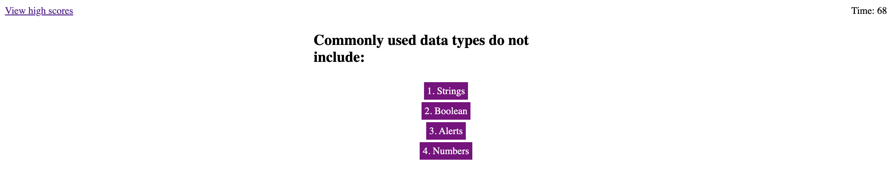
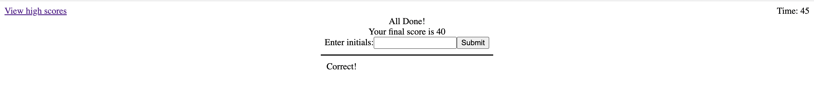

# TimedCodingQuiz

## Description

This project is for showing a multiple choice question form to user with a timer and final score. Score is saved in browser's local storage.

## Installation

N/A

## Usage
This project has 5 multiple choice questions. User has to click on the right option.
When user clicks on an option, website shows whether it was a correct or wrong answer and moves to the next question.

There is a timer which starts from 75 seconds and count downs to zero. For every wrong answer, timer decreases by additional 15 seconds.

If all the questions are done or timer reaches zero, a done page is shown to the user which also shows the final score.

User is asked to submit initials for storing score in local storage.

Screenshots of different views of the website -

## Credits

N/A

## License

Please refer to the LICENSE in the repo.

